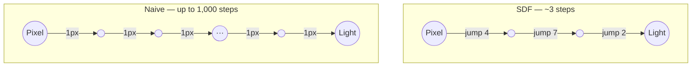

The goal in any engine is to take a bit of the real world, cram it into a computer, and then cut as many corners as possible while still keeping the illusion. Shadows are a perfect example of this.

So first, what actually is a shadow? It's simply the place where light can't reach. A light sits somewhere in the world and sends out rays in straight lines. If a ray hits something solid, it stops. The area behind that object - the bit the light can't get to - is the shadow.

High-end renderers handle this properly with ray tracing. The fancy ones even do multiple bounces, reflections, glass, water - all the real-world stuff. But that comes at a cost: millions of rays flying around. Great for a film studio, not so great for a tiny GPU in a phone.

To make life easier, let's flatten the world. Imagine we're looking straight down from above. We turn the whole scene into a 2D image: white pixels are empty space; black pixels are objects. Just by doing that, we've already cheated massively - we've thrown away the entire up/down dimension.

```mermaid
block-beta
  columns 7
  r0c0["-"] r0c1["-"] r0c2["-"] r0c3["-"] r0c4["-"] r0c5["-"] r0c6["-"]
  r1c0["-"] r1c1["-"] r1c2["-"] r1c3["-"] r1c4["-"] r1c5["-"] r1c6["-"]
  r2c0["-"] r2c1["-"] r2c2["-"] r2c3["-"] r2c4["-"] r2c5["-"] r2c6["-"]
  r3c0["-"] r3c1["-"] r3c2["-"] r3c3["-"] r3c4["-"] r3c5["-"] r3c6["-"]
  r4c0["-"] r4c1["-"] r4c2["-"] r4c3["-"] r4c4["-"] r4c5["-"] r4c6["-"]

  style r0c0 fill:#fff,color:#fff
  style r0c1 fill:#fff,color:#fff
  style r0c2 fill:#fff,color:#fff
  style r0c3 fill:#fff,color:#fff
  style r0c4 fill:#fff,color:#fff
  style r0c5 fill:#fff,color:#fff
  style r0c6 fill:#fff,color:#fff

  style r1c0 fill:#fff,color:#fff
  style r1c1 fill:#fff,color:#fff
  style r1c2 fill:#fff,color:#fff
  style r1c3 fill:#fff,color:#fff
  style r1c4 fill:#fff,color:#fff
  style r1c5 fill:#fff,color:#fff
  style r1c6 fill:#fff,color:#fff

  style r2c0 fill:#fff,color:#fff
  style r2c1 fill:#fff,color:#fff
  style r2c2 fill:#fff,color:#fff
  style r2c3 fill:#fff,color:#fff
  style r2c4 fill:#fff,color:#fff
  style r2c5 fill:#fff,color:#fff
  style r2c6 fill:#fff,color:#fff

  style r3c0 fill:#fff,color:#fff
  style r3c1 fill:#fff,color:#fff
  style r3c2 fill:#fff,color:#fff
  style r3c3 fill:#fff,color:#fff
  style r3c4 fill:#fff,color:#fff
  style r3c5 fill:#fff,color:#fff
  style r3c6 fill:#fff,color:#fff

  style r4c0 fill:#fff,color:#fff
  style r4c1 fill:#fff,color:#fff
  style r4c2 fill:#fff,color:#fff
  style r4c3 fill:#fff,color:#fff
  style r4c4 fill:#fff,color:#fff
  style r4c5 fill:#fff,color:#fff
  style r4c6 fill:#fff,color:#fff

  style r2c2 fill:#000,color:#000
  style r2c3 fill:#000,color:#000
  style r2c4 fill:#000,color:#000
```

Next, instead of simulating light travelling outward, we flip the problem. For each pixel, we check whether it can "see" the light. We draw a line from the pixel to the light, stepping along it one pixel at a time. If we hit a black pixel, we're in shadow. If we make it all the way to the light, we're lit.

Simple idea. Terrible performance.

If our world is 1,000 × 1,000, that's a million pixels. Each trace might have to walk up to 1,000 steps towards the light. That's a billion pixel reads. Now imagine six lights at 60 fps. Suddenly we're at 360 billion reads per second.

My phone can do maybe 10 billion. So... yeah. Not happening.

This is where Signed Distance Fields come in. Ignore the "signed" part - it's to do with being inside or outside. We don't need it here. Picture a grid (or field) where each cell stores the distance it is from the nearest object.

- 0 means you're on an object
- 1 means you're next to an object
- 2 means you're two pixels away
- and so on

Here's what that looks like for a small piece of the world:

```mermaid
block-beta
  columns 7
  r0c0["3"] r0c1["2"] r0c2["2"] r0c3["2"] r0c4["2"] r0c5["2"] r0c6["3"]
  r1c0["2"] r1c1["1"] r1c2["1"] r1c3["1"] r1c4["1"] r1c5["1"] r1c6["2"]
  r2c0["2"] r2c1["1"] r2c2["0"] r2c3["0"] r2c4["0"] r2c5["1"] r2c6["2"]
  r3c0["2"] r3c1["1"] r3c2["1"] r3c3["1"] r3c4["1"] r3c5["1"] r3c6["2"]
  r4c0["3"] r4c1["2"] r4c2["2"] r4c3["2"] r4c4["2"] r4c5["2"] r4c6["3"]

  style r0c0 fill:#fff,color:#000
  style r0c1 fill:#fff,color:#000
  style r0c2 fill:#fff,color:#000
  style r0c3 fill:#fff,color:#000
  style r0c4 fill:#fff,color:#000
  style r0c5 fill:#fff,color:#000
  style r0c6 fill:#fff,color:#000

  style r1c0 fill:#fff,color:#000
  style r1c1 fill:#fff,color:#000
  style r1c2 fill:#fff,color:#000
  style r1c3 fill:#fff,color:#000
  style r1c4 fill:#fff,color:#000
  style r1c5 fill:#fff,color:#000
  style r1c6 fill:#fff,color:#000

  style r2c0 fill:#fff,color:#000
  style r2c1 fill:#fff,color:#000
  style r2c2 fill:#fff,color:#000
  style r2c3 fill:#fff,color:#000
  style r2c4 fill:#fff,color:#000
  style r2c5 fill:#fff,color:#000
  style r2c6 fill:#fff,color:#000

  style r3c0 fill:#fff,color:#000
  style r3c1 fill:#fff,color:#000
  style r3c2 fill:#fff,color:#000
  style r3c3 fill:#fff,color:#000
  style r3c4 fill:#fff,color:#000
  style r3c5 fill:#fff,color:#000
  style r3c6 fill:#fff,color:#000

  style r4c0 fill:#fff,color:#000
  style r4c1 fill:#fff,color:#000
  style r4c2 fill:#fff,color:#000
  style r4c3 fill:#fff,color:#000
  style r4c4 fill:#fff,color:#000
  style r4c5 fill:#fff,color:#000
  style r4c6 fill:#fff,color:#000

  style r2c2 fill:#000,color:#fff
  style r2c3 fill:#000,color:#fff
  style r2c4 fill:#000,color:#fff
```

This doesn't tell us which direction the object is, but it does tell us how far we can safely move without hitting anything.

So, instead of stepping one pixel at a time towards the light, we look at the distance and jump that many pixels in one go. If the SDF says "12", we skip 12 pixels and are guaranteed not to hit anything.

Suddenly, instead of 1,000 tiny steps, we might only need 10 or 20 big ones.

Now the maths starts to look a lot friendlier - maybe 7 or 8 billion reads per second instead of hundreds of billions. That's the kind of number a phone can actually handle.

Not bad for a bit of preprocessing. Next up: how to add height back into our world without losing all the performance gains?

